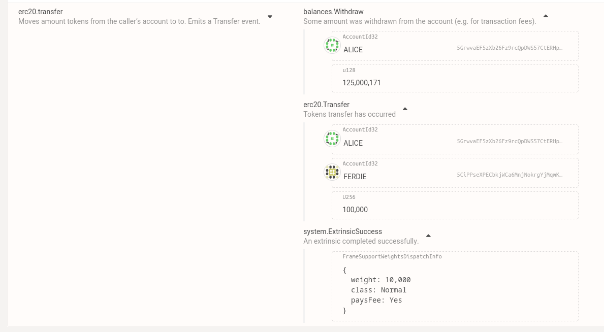

# Polkaswap test task for Soramitsu

This project is based on `substrate-node-template` and contains a pallet implementing functionality resembling [ERC20](https://github.com/OpenZeppelin/openzeppelin-contracts/blob/master/contracts/token/ERC20/ERC20.sol) smart contract.

The pallet implementation is located in `pallets/erc20`

## Feature mapping

The mapping of ERC20 functions are as follows:

- `name`, `symbol` and `decimals` are available as metadata entries of the pallet
- `totalSupply`, `balanceOf` and `allowance` are available as storage getters
- `transfer`, `approve` and `transferFrom` are implemented as dispatchable functions
- `_mint` and `_burn` are implemented as public, but non-dispatchable functions and can be run only with other pallets

Instead of returning bools like the original functions, I decided to return rust errors, which is the way to go for dispatchable functions.

Otherwise, I believe, the implementation matches closely what happens in `ERC20`

Even though it was allowed, I did not use `pallet-balances`, as its concepts do not seem to match to what `ERC20` expects (with stuff like locked funds). Also, it allowed me to expose nice storage getters.

## Testing

I wrote some amount of unit tests for the pallet (can be found `pallets/erc20/tests.rs`).

Test cases include basic ones (using functions as intended) along with all possible error conditions and (some) corner-cases.

## Documentation

There are doc-strings for all public items exposed from the pallet
